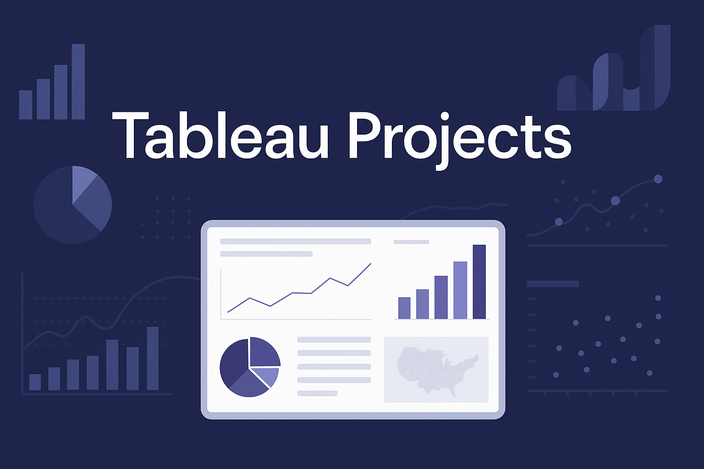

# Tableau-Projects
Welcome to my collection of Tableau projects: a curated collection of interactive dynamic dashboards designed to visualize, explore, and derive insights from real-world datasets. This repository showcases practical applications of Tableau in data storytelling, trend analysis, and dynamic reporting across domains such as finance, health, and operations — with a focus on clarity, interactivity, and insight-driven design.

---

## 🔍 Projects

### 📌 HR Analytics Dashboard

An interactive dashboard visualizing employee attrition trends within an organization. Built from real-world HR data, the dashboard uncovers key patterns in turnover, departmental trends, and workforce demographics.

**Highlights:**
- Filters for Department, Age Group, Gender, and Attrition Type
- KPI tiles to highlight key stats like Attrition Rate and Avg. Years at Company
- Heat maps and bar charts to explore correlations
- Custom-calculated fields for turnover insights

> 📂 Navigate to the project folder: [`/hr-analytics-dashboard`](hr-analytics-dashboard/)

---

### 🗺️ Customer Complaints Dashboard (USA)

A detailed and dynamic dashboard that analyzes customer complaints across all U.S. states, segmented by various product types in the banking sector. The visualization enables granular filtering and geographical analysis of complaints volume and patterns.

**Highlights:**
- State-level mapping of complaint density
- Product-type filters: Mortgage, Bank Services, etc.
- Map type toggling between Tile Maps and Symbol Maps
- Dynamic filtering using Parameters and Global Filters
- Designed for clarity and stakeholder presentation

> 📂 Explore the project: [`/customer-complaints-dashboard`](customer-complaints-dashboard/)

---

## 💡 Tools & Techniques

- Tableau Desktop (v2023+)
- Data source connections via Excel/CSV
- Parameters & dynamic sheet swapping
- Filter Actions and Global Filters
- Calculated Fields for KPIs and trend indicators
- Dashboard Containers and Layout Hierarchy
- Interactivity through highlight and hover actions

---

## 📁 Structure

Each project includes:
- `.twbx` Tableau packaged workbook
- A `README.md` with project breakdown and visuals
- A `.assets/` folder containing screenshots or graphics

---

## 👤 About Me

**Username:** [`kwesisbits`](https://github.com/kwesisbits)  
Driven by a passion for meaningful data experiences and impactful dashboard design using Tableau and other visualization tools.

Feel free to explore the dashboards, clone the repository, or connect with me for feedback or collaboration.

---
