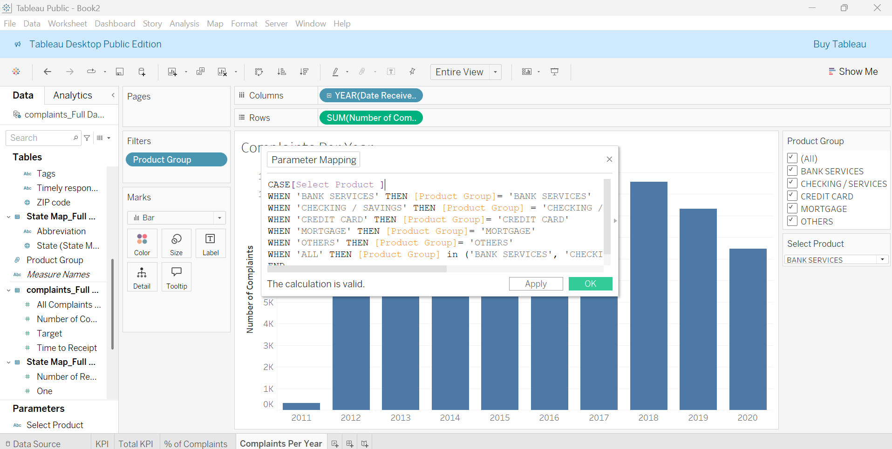

# 🧾 Customer Complaint Dashboard

An interactive Tableau dashboard visualizing customer complaints related to banking services across all 50 U.S. states. This project focuses on mapping complaint density, analyzing service categories, and allowing users to explore issues through dynamic filters.

---

## 📊 Dashboard Overview

The dashboard presents a state-by-state breakdown of customer complaints using either a traditional map or a tile map view. Users can filter complaints by **product category**, including Bank Services, Mortgage, Credit Card, Checking, and Others.

**Key Features:**
- Toggle between map types (geographic vs tile map)
- Product filter for complaint category segmentation
- Hover-enabled insights by state
- Dynamic labeling and tooltips

> 💡 *The dashboard provides a clear geographic view of where service complaints are concentrated and what services are most frequently cited.*

---

## 🔧 Data Preparation & Integration

The dataset was loaded from a structured CSV file and connected with a comprehensive U.S. States dataset to enable state-level visualizations.

**Process Highlights:**
- Merging complaint records with geographic data
- Standardizing state names and abbreviations
- Cleaning product category values for consistent filtering

---

## ⚙️ Dashboard Development

Throughout the design process:
- **Calculated Fields** were created to support parameter-driven filtering
- Worksheets were constructed to support dual-map configurations
- Parameters and filters were used to toggle dashboard visuals

---

## 🗺️ Dashboard Views

### Full Dashboard – Map View Enabled
The primary dashboard with:
- State-by-state map or tile map visualization
- Product filter to narrow complaint types
- Clear indicators of complaint volume

### Tile Map View Enabled
Here, the dashboard is toggled to show the **tile map**, offering a grid-based U.S. layout that simplifies geographic comparisons.

---

## 🛠️ Key Skills Demonstrated

- Tableau data connection and geographic joining
- Dynamic parameter creation and filter design
- Custom map and tile map implementations
- Dashboard interactivity and layout organization

---

## 📁 Files in this Project

- `Customer_Complaints_Dashboard.twbx` – The Tableau workbook.
- `.assets/` – Screenshots and visuals used in this project.
- `README.md` – Project documentation.

---

## 📌 About

**Author**: [kwesisbits](https://github.com/kwesisbits)

This dashboard provided valuable hands-on experience with Tableau’s mapping tools, parameter controls, and complaint data visualization.

