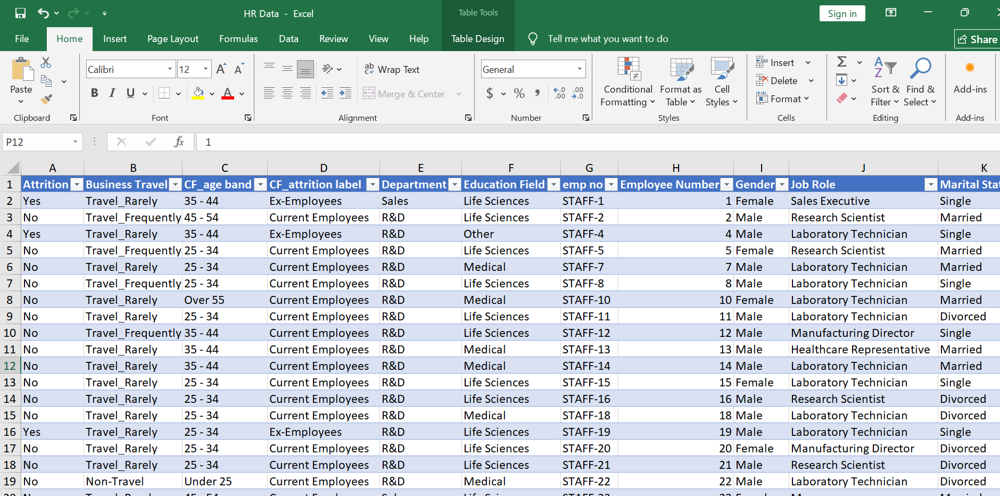
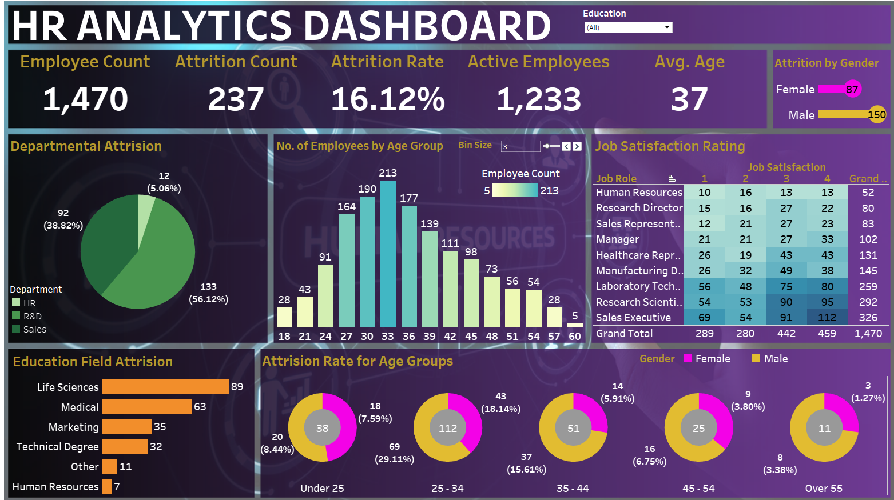
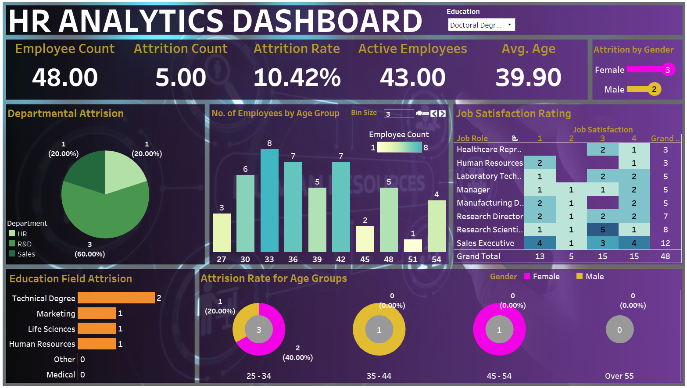

# 📊 HR Analytics Dashboard

An interactive Tableau dashboard analyzing employee attrition across departments, education levels, and demographics. This project explores patterns in attrition, highlighting the departments and roles most affected, and surfaces insights useful for HR decision-making.

---

## 📊 Dashboard Overview

This dashboard was developed using a real-world HR dataset. It enables users to filter and visualize employee attrition based on variables such as **department**, **education level**, **marital status**, and **job role**.

**Key Questions Explored:**
- Which departments have the highest attrition rates?
- How does education level affect the likelihood of attrition?
- Are there noticeable trends across different job roles or marital statuses?

> 🧠 *One valuable insight was that the R&D department had the highest attrition rate, while employees with a Doctoral degree showed the lowest likelihood of leaving.*

---

## 🧹 Data Preparation

The data was first inspected in Excel, where preliminary cleaning and structure analysis were performed to ensure the dataset was fit for Tableau integration.

**Steps Included:**
- Dropping redundant columns
- Formatting dates and categorical fields
- Ensuring clean and consistent column naming

---

## 🧩 Data Modeling & Dashboard Logic

Within Tableau:
- **Filters** were created for Education, Job Role, and Department
- **Calculated Fields** were used to derive Attrition Rates
- **KPIs** (Key Performance Indicators) display total employees, attrition percentage, and department-wise stats
- The dashboard layout was built using **containers** to ensure a responsive layout

---

## 🔍 Focused Insight View

### Full Dashboard View

### Filtered View – Doctoral Degree
Employees with doctoral degrees exhibit the **lowest attrition rate** across the dataset.

---

## 🛠️ Key Skills Demonstrated

- Tableau dashboard development and storytelling
- Interactive filters and dynamic chart views
- Dataset preparation and visualization logic
- Extracting and communicating actionable insights

---

## 📁 Files in this Project

- `HR_Analytics_Dashboard.twbx` – The Tableau project file.
- `.assets/` – All project visuals and screenshots.
- `README.md` – Documentation for the project.

---

## 📌 About

**Author**: [kwesisbits](https://github.com/kwesisbits)

This was my first Tableau project and served as a great exercise in exploring attrition metrics, HR analytics, and visual storytelling in Tableau.

